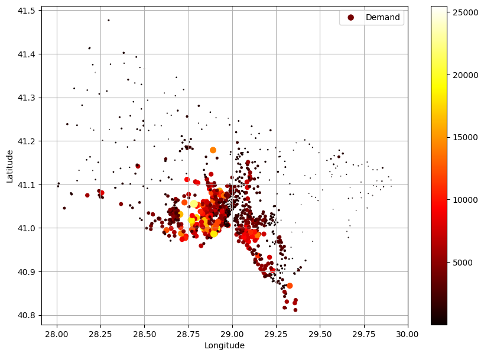
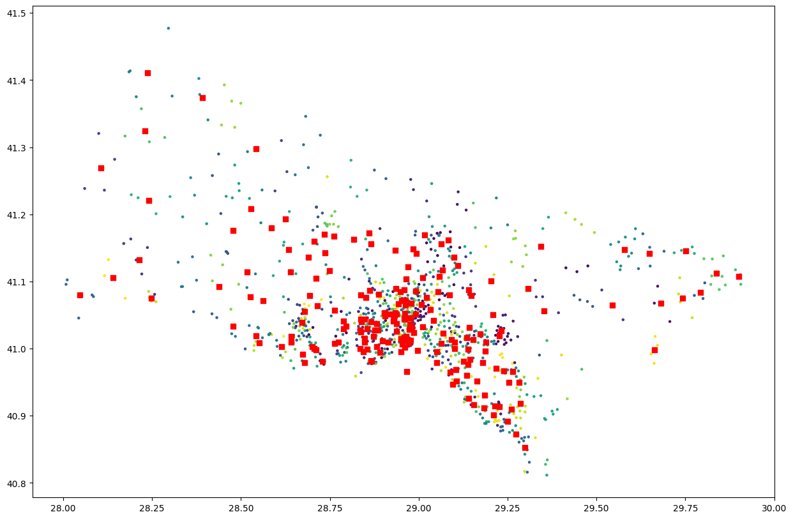
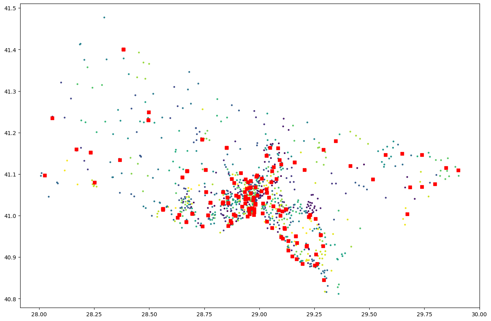

In recent years, a transformative shift in automotive preferences towards Battery Electric
Vehicles (BEVs) has gained momentum, driven by their environmental advantages and
economic efficiency compared to traditional Internal Combustion Engine cars.
This project focuses on Istanbul, Turkey's most populous city, where transportation demands
are high. The primary aim is to predict the future demand for electric vehicles in Istanbul and
propose a model for optimizing the distribution of new charging stations across the city. This
initiative seeks to decrase the range anxiety among EV users by strategically locating charging
infrastructure.

The research employs a forward-looking methodology, projecting the number of EVs in
Istanbul's districts over the next 30 years. A tailored mathematical model, incorporating the
S-curve structure to represent the adoption rate of EVs, will be developed. This model
considers factors such as SEGE scores, reflecting the developmental status of each district, to
refine projections. The temporal span is divided into six periods, each lasting five years from
2020 to 2050. Through this comprehensive analysis, optimal locations for electric charging
stations in Istanbul will be identified at the conclusion of each period, offering a holistic
strategy to alleviate range anxiety and foster sustainable growth in EV adoption.

